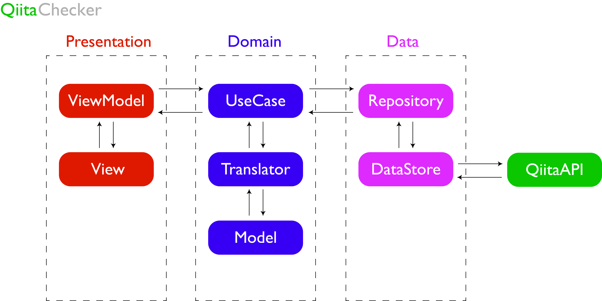

<div align="center">
  </img>
</div>

# QiitaChecker
## What Is This App?
QiitaChecker enables you to watch the latest articles of Qiita. However, some problems are existed and should be revised.

## App Architecture
In this app, I adopted MVVM + Clean Architecture. A Detail is shown in this figure.<br>
This app separates three layers, `presentation layer`, `domain layer`, and `data layer`. In `presentation layer`, UI Event and Databinding are handled with `ViewController` and `ViewModel`. Essentially, presentation logics are stored in `ViewModel`. In `domain layer`, `UseCase` stores and performs business logics and translates received immutable data (`Entity`) into `Model` through `Translator`. In `data layer`, `Repository` receives immutable data with `DataStore` and pass it to `UseCase`. Also, `DataStore` receives the immutable data as `Entity` from QiitaAPI and pass `Entity` to `Repository`.

<div align="center">
  </img>
</div>

## How To Run This App
1. **`rbenv`, `carthage`, `mint` setup**<br>
Just run this command in your terminal
```
brew install rbenv ruby-build
brew install carthage
brew install mint
```

2. **`rbenv` install**<br>
Just run this command in your terminal
```
rbenv install $(cat .ruby-version)
```

3. **set the path in `.bashrc` and run `.bashrc`**<br>
Write the command in `.bashrc` to set the path
```
[[ -d ~/.rbenv  ]] && \
  export PATH=${HOME}/.rbenv/bin:${PATH} && \
  eval "$(rbenv init -)"
```
and run it with this command
```
source ~/.bashrc
```

4. **bundler install**<br>
Just run this command in your terminal
```
gem install bundler:2.0.1
```

5. **run `Makefile` and open the workspace**<br>
Just run this command in the project root in your terminal
```
make
```
and 
```
open QiitaChecker.xcworkspace
```


## Used Libraries
- [QiitaAPI](https://qiita.com/api/v2/docs)
- [RxSwift](https://github.com/ReactiveX/RxSwift)
- [Alamofire](https://github.com/Alamofire/Alamofire)
- [Parchment](https://github.com/rechsteiner/Parchment)
- [Floaty](https://github.com/kciter/Floaty)
- [Nuke](https://github.com/kean/Nuke)  
- [XcodeGen](https://github.com/yonaskolb/XcodeGen)
- [SwiftLint](https://github.com/realm/SwiftLint)
- [SwiftGen](https://github.com/SwiftGen/SwiftGen)

# Acknowledgements (Reference for Me Specifically)
- https://medium.com/@rockname/clean-archirecture-7be37f34c943
- https://www.kagemiku.com/blog/archives/442
- https://github.com/YutoMizutani/architectures
- https://www.slideshare.net/ssuser3bddf8/clean-architecture-71046114
- https://qiita.com/H_Crane/items/d2d316b086745417ffae
- https://qiita.com/shira-shun/items/778e65308f26860664fc

# License
Under MIT